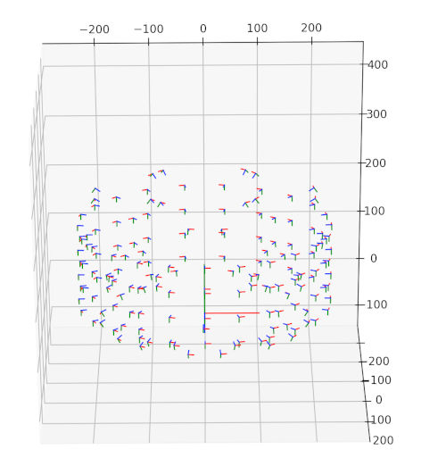

# dataset-name


## Data overview


## Calibration format

Calibration data is provided an `calibration.csv` files that have the following format:

```
name, w, h, rx, ry, rz, tx, ty, tz, fx, fy, px, py
Cam001, 4112, 3008, 3.14159265359, 0.0, 0.0, 1.0, 0.0, 230.0, 1.773863, 1.773863, 0.5, 0.5
...
```

Here, the rotation vector `rx, ry, rz` is in axis-angle format and focal length and principal point are normalized by image width and height.

To quickly visualize the cameras in 3D the following snippet can be used:
```python
#!/usr/bin/env python3
import numpy as np
from camera_data import CameraData, read_calibration_csv
from matplotlib import pyplot as plt
from scipy.spatial.transform import Rotation

cameras = read_calibration_csv("/path/to/calibration.csv")

fig = plt.figure()
ax = fig.add_subplot(111, projection='3d')
ax.set_xlim(-250, 250)
ax.set_ylim(-100, 400)
ax.set_zlim(-250, 250)

def draw_axis(c,v,color):
    p = c+v
    ax.plot([c[0], p[0]], [c[1], p[1]], [c[2], p[2]], color=color, lw=1)

s = 10
draw_axis(np.array([0,0,0]), np.array([10*s,0,0]), "red")
draw_axis(np.array([0,0,0]), np.array([0,10*s,0]), "green")
draw_axis(np.array([0,0,0]), np.array([0,0,10*s]), "blue")
for camera in cameras:
    rotation = Rotation.from_rotvec(camera.rotation_axisangle)
    draw_axis(camera.translation, rotation.apply(np.array([s,0,0])), "red")
    draw_axis(camera.translation, rotation.apply(np.array([0,s,0])), "green")
    draw_axis(camera.translation, rotation.apply(np.array([0,0,s])), "blue")
plt.show()
```

Which will result in a visualization similar to this one:



A pointcloud can be projected to the image plane via:

```python
TODO(mr-synth): self-contained example
```

## Installation

The simplest way to use the python tools is to include this repository in your `PYTHONPATH`:
```bash
# cd here first
export PYTHONPATH="$PYTHONPATH:`pwd`"
```

We provide cross-platform C++ tools to render alembic `.abc` files and to extract them to wavefront `.obj` files. These tools can be installed as follows on Ubuntu (similar on MacOS):
```bash
# Install system dependencies

# Install Pangolin
cd mesh_tools/third_party/Pangolin
git clone --recursive https://github.com/stevenlovegrove/Pangolin.git # TODO use submodule
cd Pangolin
./scripts/install_prerequisites.sh recommended
cmake -B build
cmake --build build
cd ../..

# Build tools
cmake -B build
cmake --build build
```

## Exporters

We provide example exporters to the following [Blender](https://www.blender.org/), [NGP](https://github.com/NVlabs/instant-ngp/blob/master/docs/nerf_dataset_tips.md) and [Colmap](https://colmap.github.io/format.html#text-format) format, which are detailed below.

### Blender

Example execution:
```bash
blender --background --python ./export_cameras_blender.py -- \
--csv /path/to/calibration.csv \
--images /path/to/directory/with/first/frames \
--obj /path/to/obj/or/abc/file/Frame000001.obj \
--blend /tmp/example_output_blend.blend
```

## Trouble shooting

* For Blender related issues (like alembic mesh animation not showing), please first ensure you are running the latest Blender version. We tested with Blender 3.2.1.


## Known issues
